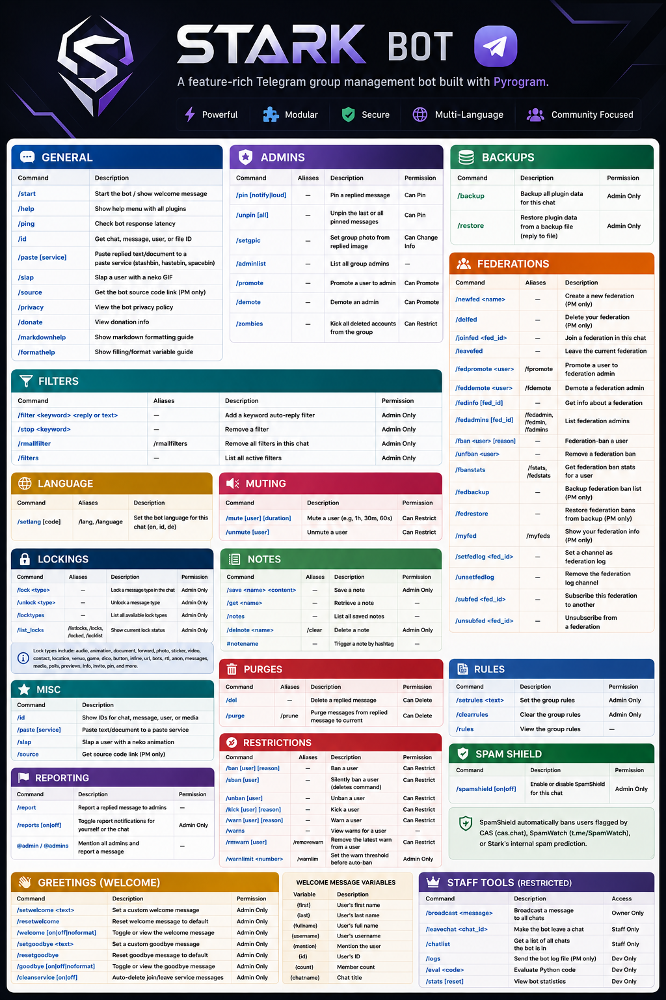

# Anjani Bot

A feature-rich Telegram group management bot built with [Pyrogram](https://github.com/pyrogram/pyrogram) and MongoDB.

---

## Requirements

- Python 3.10+
- MongoDB instance
- Telegram API credentials (`API_ID`, `API_HASH`)
- Bot token from [@BotFather](https://t.me/botfather)

## Setup

1. Copy `.env.example` to `config.env` and fill in the values.
2. Install dependencies:
   ```bash
   pip install poetry
   poetry install
   ```
3. Run the bot:
   ```bash
   python -m anjani
   ```

---

## Available Commands



## Supported Languages

| Code | Language |
|------|----------|
| `en` | 🇺🇸 English |
| `id` | 🇮🇩 Indonesian |
| `de` | 🇩🇪 German |

---

## License

[GPL-3.0](LICENSE)
